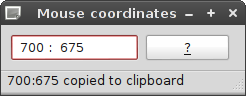

# CoordApp #

CoordApp is a simple mouse-coordinates displayer.

* Press Ctrl-C to copy coordinates.
* Press Space to stop refreshing.
* Press G for a faster refresh by grabbing the mouse (but ungrabs/fallbacks after one click).
* Press A to set the always-on-top window flag.

## Download ##

[Project repository](https://gitlab.com/hydrargyrum/attic/tree/master/coordapp)

CoordApp requires Python and PyQt or PySide.
CoordApp is licensed under the the [WTFPLv2 ../wtfpl].

