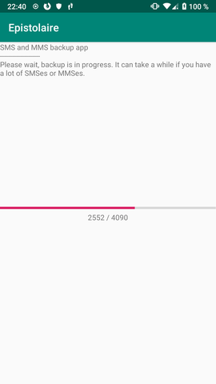
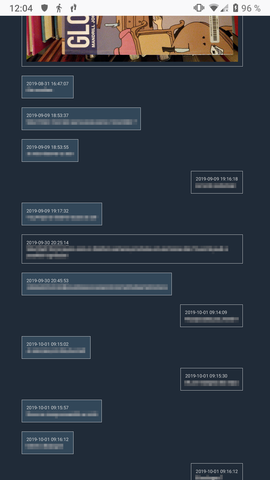

# Epistolaire

Epistolaire is an Android app to backup SMSes and MMSes.

It dumps all messages and attachments to a JSON file on the phone storage (so you can copy it whatever way you like, rsync, Syncthing, ownCloud - you name it).

There's an extra Python [tool](https://gitlab.com/hydrargyrum/epistolaire/-/tree/master/viewer) to convert it to pretty HTML pages if you want to without effort.
And if you know a little know a tiny bit of development, the JSON format is straightforward to use (see the [JSON schema](https://gitlab.com/hydrargyrum/epistolaire/-/blob/master/backup.schema.json)).

Epistolaire is primarily for saving messages elsewhere, as it cannot (yet?) restore them.
The UI is very basic because it's my first Android app.

# Screenshots

*The app, backup in progress*

*Example using a HTML messages viewer (using the optional tool)*

# Download
[On F-Droid](https://f-droid.org/fr/packages/re.indigo.epistolaire/)

[Gitlab project repository](https://gitlab.com/hydrargyrum/epistolaire) (and [on Github](https://github.com/hydrargyrum/epistolaire) too)

# License
Epistolaire is licensed under the [Unlicense](https://unlicense.org/).
