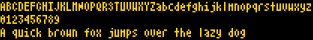

# fonts2png

fonts2png is a program that previews font files to images files

## Usage ##

Default options (output to current directory):

``fonts2png -d /fonts/dir/*``

A few more options:

``fonts2png -b white -c "#000000" -o /output/images/dir -s 30 -t "sample text" /fonts/dir/*``

Uses white background, black text, text "sample text", 30 points size.

## Example output ##

``fonts2png -o /tmp -c gold -b black -s 12 /usr/share/fonts/truetype/ttf-atarismall/AtariSmall.ttf``

Creates /tmp/[AtariSmall](http://gnu.ethz.ch/linuks.mine.nu/atari/).png:

## Requirements & Misc ##

A shell and ImageMagick. fonts2png is licensed under the [WTFPLv2 ../wtfpl]. fonts2png is ~50 lines of code.

## Download ##

[Project repository](https://github.com/hydrargyrum/attic/tree/master/fonts2png)

## History ##

This program was done to render the AEnigma set of fonts (more than 400 fonts) which unfortunately did not provide any [samples](aenigma).

