# Some images #

## Context Free Design Grammar (CFDG) ##

[CFDG](http://www.contextfreeart.org/) is a program for building images with a set of context-free rules, in a source language.

### The [Sierpinski carpet](https://en.wikipedia.org/wiki/Sierpinski_carpet) ###

[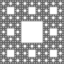](cfdg/carpet.png)
[CFDG source](cfdg/carpet.cfdg)

### Some black/white texture (not the XOR one) ###

[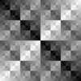](cfdg/sq3-2.png) [CFDG source](cfdg/sq3-2.cfdg)

### A few others for CFDG 2 ###

[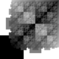](cfdg/sq_2_1.png) 
[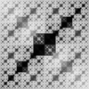](cfdg/sq_4_1.png) 
[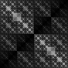](cfdg/sq_4_-1.png) 
[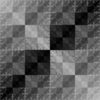](cfdg/sq_5_1.png) 
[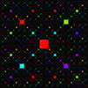](cfdg/sq_11_s10.png) 
[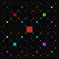](cfdg/sq_16_s10.png) 

## Patterns ##

[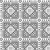](pattern/motif1.png) 
[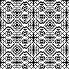](pattern/motif3.png) 
[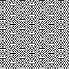](pattern/motif4-alpha.png) 
 
[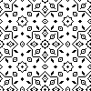](pattern/motif7.png) 
[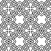](pattern/motif8.png) 
[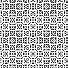](pattern/motif9.png) 
[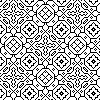](pattern/motif12-alpha1.png) 
