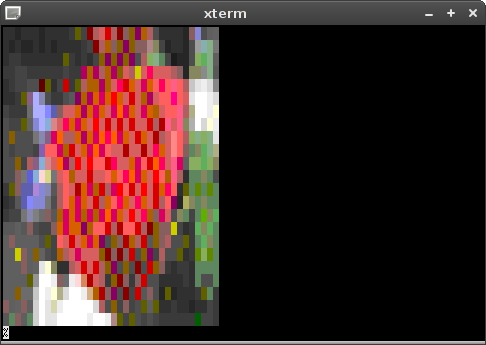

# image2xterm

image2xterm is an "image2ascii" program that uses XTerm's 256 colors capability

## Usage ##

Display an image on a 256 colors capable terminal:

```
image2xterm rose.png
```

 -> 

Compensate the font characters not being square by applying a stretch factor (2):

```
image2xterm -s 2 rose.png
```


Output to file:

```
image2xterm -s 2 -c 80 -r 40 rose.png > rose.xans
```

[rose.xans](rose.xans)

## Requirements & Misc ##

image2xterm requires Python and the [Python Image Library](http://www.pythonware.com/library/pil/). image2xterm is licensed under the [WTFPLv2](../wtfpl).

The 256-colors palette is available [as PNG](xterm256palette.png). 

Convert any image to the XTerm 256-colors palette with ImageMagick: ``convert input.png -remap xterm256palette.png output.png``

## Download ##

[Project repository](https://github.com/hydrargyrum/attic/tree/master/image2xterm)
