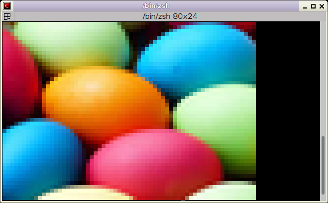
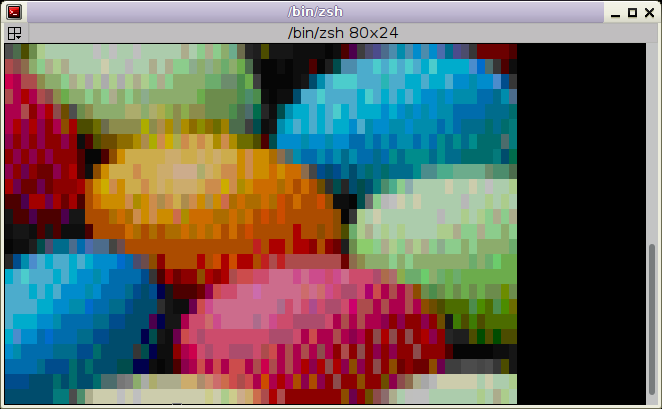

# image2xterm

image2xterm is an "image2ascii" program that uses terminal RGB24 mode or 256 colors

# Features

* uses [ANSI escape codes](https://en.wikipedia.org/wiki/ANSI_escape_code)
* can use xterm's 256 colors
* can use full RGB [24 bits colors](https://en.wikipedia.org/wiki/Color_depth#True_color_(24-bit))
* can use [Unicode block characters](https://en.wikipedia.org/wiki/Box-drawing_character#Unicode) for finer resolution or simply plain ASCII spaces

# Usage

Display an image on a 256-colors capable terminal:

```
image2xterm eggs.jpg
```

 -> 

Some terminals support 24-bits colors, giving even better rendition, use `--truecolor` for it:

```
image2xterm --truecolor eggs.jpg
```



Unicode block characters are used to have colored squares.

If Unicode cannot be used, simple spaces can be used with `--spaces`.
Since font characters are usually higher than wide, one character is interpreted as its height being twice the width.

```
image2xterm --spaces eggs.jpg
```



Output to file:

```
image2xterm -c 80 -r 24 eggs.jpg > eggs.xans
cat eggs.xans
```

[eggs.xans](eggs.xans)

# Requirements & Misc

image2xterm requires Python and the [Python Image Library](http://www.pythonware.com/library/pil/). image2xterm is licensed under the [WTFPLv2](../wtfpl).

The 256-colors palette is available [as PNG](xterm256palette.png). 

Convert any image to the XTerm 256-colors palette with ImageMagick: ``convert input.png -remap xterm256palette.png output.png``

# Download

[Project repository](https://gitlab.com/hydrargyrum/attic/tree/master/image2xterm)
