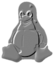
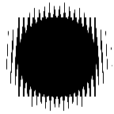
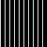
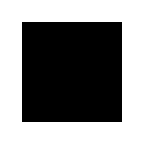
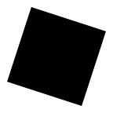
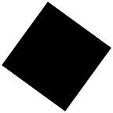
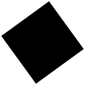
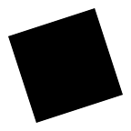

# ImageMagick stuff #

A few images or snippets made with ImageMagick

# Embossing #

To emboss an image, and use the result as a mask to overlay an image.

```
convert tux.png -colorspace gray -fx "u-p[-1,-1]+.5" tmp.mask.png
convert other.png tmp.mask.png -gravity center -compose overlay -composite result.png
```

 -> 

 +  -> 

# Read a CAPTCHA on console #

A grayscale CAPTCHA image (like reCAPTCHA's) can be read on console with the help of [XPM format http://en.wikipedia.org/wiki/X_PixMap].
XPM format is a format where each pixel is represented by an ASCII character.

```
convert captcha2-sample.jpg -negate -resize '200%x100%!' -colors 4 xpm: | less -S
```

Negate can be used if the image has a white background. Number of colors is reduced to 4 for less graphical clutter. Image is expanded 2 times in width to compensate a little that ASCII characters are higher than wide unlike pixel which are square.


becomes (1920x1080 console)


Walk back 3 meters away from your screen to watch for better view. [captcha2-ascii.xpm](captcha2-ascii.xpm)

# "Bookshelf" effect #

Slice multiple images and put the slices aside (960 is the max height, and 50 is the slice width)

```
convert $IMAGES -resize 'x960>' -gravity center -crop '50x+0+0!' +repage miff:- | 
montage - -gravity center -geometry +5+5 -tile x1 bookshelf.png
```

[](bibli.jpg)

With zsh, the 20 first files of current directory can be selected with this pattern: *(.[1,20])

# Chromatic aberration #

Create a chromatic aberration on a photo by moving separately each color channel by a few pixels.

```
convert bananas.jpg -virtual-pixel edge -channel R -fx "p[-1,-2]" -channel B -fx "p[2,1]" bananas-artefact.jpg
```

 -> 

# Hatched text #

Create a hatched background pattern and add text using a different hatched pattern.

```
TXT=cookie

PATTERN1=pattern:HS_FDIAGONAL
PATTERN2=pattern:HS_BDIAGONAL
convert -pointsize 100 "label:$TXT" -trim -gravity center -extent 125% -channel o -fx r -size 500x500 $PATTERN1 -compose out -composite tmp.txt.png
convert -pointsize 100 "label:$TXT" -trim -gravity center -extent 125% -negate -channel o -fx r -size 500x500 $PATTERN2 -compose out -composite tmp.bg.png
convert tmp.txt.png tmp.bg.png -compose over -composite out.png
```


With more spacing:

```
convert -pointsize 100 "label:$TXT" -trim -gravity center -extent 125% -morphology dilate Octagon:1 -channel o -fx r -size 500x500 $PATTERN1 -compose out -composite tmp.txt.png
convert -pointsize 100 "label:$TXT" -trim -gravity center -extent 125% -negate -morphology dilate Octagon:1 -threshold 50% -channel o -fx r -size 500x500 $PATTERN2 -compose out -composite tmp.bg.png
convert tmp.txt.png tmp.bg.png -compose over -composite out.png
```


A few other patterns:

* HORIZONTAL-VERTICAL


* HORIZONTAL2-HORIZONTAL


# Animation illusion with a scrolling shutter #

It's possible to make an optical illusion of animating an object by just moving a shutter over a static image. Here's a sample of such an animation.

<div style="background: url(scanimation/scanimation.png) fixed content-box; height: 300px; width: 282px; overflow: auto;">
	<div style="background: url(scanimation/scanimation-mask.png) content-box; height: 282px; width: 2800px;">
		&nbsp;
	</div>
</div>

It first consists of a weird image:



and a shutter that is scrolled over the weird image:



What is this weird image? It is the superposition of each animation frame, where each frame has first been sliced to show only the portions that the shutter should allow to show.

We started from this gif:



     

which contains 6 animation frames. To be able to do the superposition, we will not show the same portion of pixels for any two frames (that's the shutter trick!).
The shutter shows columns of one-pixel width at a time, corresponding to one frame, so we should not consider the hide the remaining 5 frames, the 5 remaining 5 pixels column.

Here's what we take from the first frame:

For the second frame, we should just shift the mask a little, and so on, finally we superpose all parts.

```
convert seq.gif -coalesce seq-%d.png
NFRAMES=$(ls seq-*.png | wc -l)
DIM=$(identify -format %Wx%H seq-0.png)

convert -size 1x1 xc:none -size $((NFRAMES-1))x1 xc:black +append mask.png

for i in `seq 0 $((NFRAMES-1))`
do
	convert -size $DIM -tile-offset +$i+0 tile:mask.png -transparent black seq-$i.png -compose in -composite miff:-
done | convert - -flatten out.png
```


