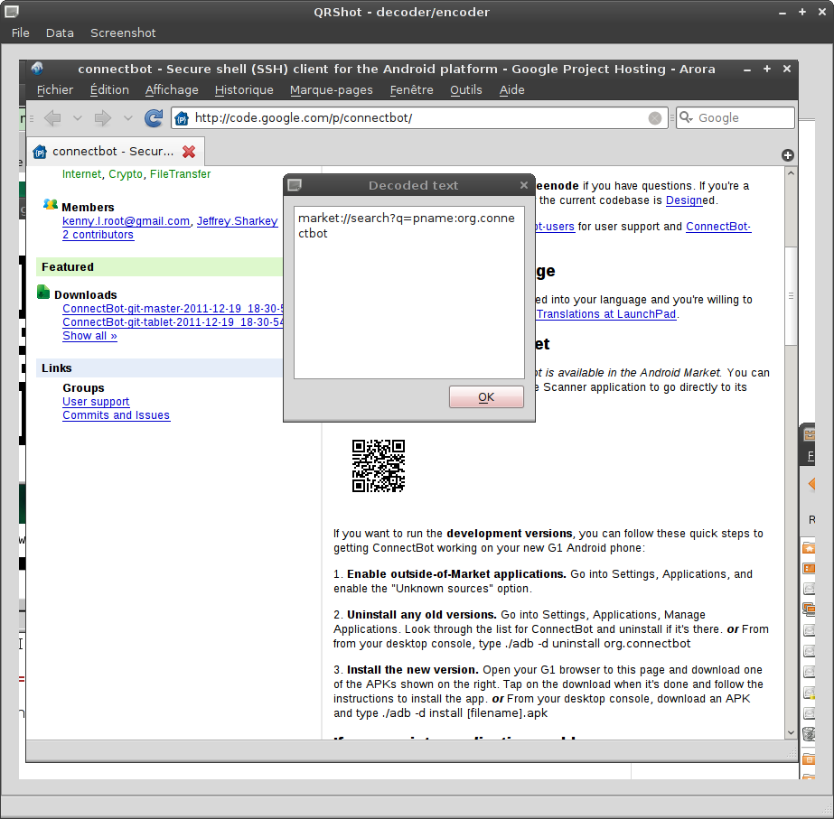

# qr-shot

qr-shot is a GUI program to encode or decode QRCodes which can use screenshots

## Features/Uses ##

If you want to decode a QR Code that is on a webpage, you can use qr-shot to take a screenshot, narrow the region, and qr-shot will decode the content.
You can open an existing image file, crop it and decode it.
You can also use it to generate a QR Code image file based on your text input.

## Screenshots ##

## Requirements & Misc ##

qr-shot requires PyQt4 (or PySide) and python-zbar (to decode) and/or python-qrencode (to encode).
qr-shot is licensed under the [WTFPLv2](../wtfpl).

## Download ##

[Project repository](https://github.com/hydrargyrum/attic/tree/master/qr-shot)