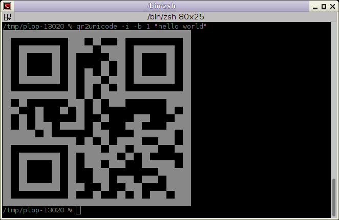

# qr2unicode

qr2unicode is a program to display a QR Code on a terminal, using ANSI drawings.

## Example output ##

ANSI sequences in a term:



Unicode box-drawing characters:

```
  ██████████████    ██  ████  ██████████████  
  ██          ██  ████  ██    ██          ██  
  ██  ██████  ██  ████    ██  ██  ██████  ██  
  ██  ██████  ██    ██  ██    ██  ██████  ██  
  ██  ██████  ██  ██      ██  ██  ██████  ██  
  ██          ██  ██    ████  ██          ██  
  ██████████████  ██  ██  ██  ██████████████  
                  ██████████                  
  ████  ██    ████  ████      ██████  ████    
  ██  ██  ██        ██        ████    ██████  
    ██      ████      ██  ████      ██    ██  
    ██████        ██  ████      ██████  ██    
    ██  ████  ████    ██  ██  ██  ██    ████  
                  ████  ██            ██  ██  
  ██████████████  ██████    ██  ████    ██    
  ██          ██      ████████      ██    ██  
  ██  ██████  ██    ██████    ██          ██  
  ██  ██████  ██  ████  ██      ████    ████  
  ██  ██████  ██          ██    ████  ██  ██  
  ██          ██  ██  ██    ██████            
  ██████████████  ██  ██████      ████  ██    
```

Text encoded: "foo bar"

## Requirements & Misc ##

qr2unicode requires Python3, and python-qrcode.
qr2unicode is licensed under the [WTFPLv2](../wtfpl).

## Download ##

[Project repository](https://github.com/hydrargyrum/attic/tree/master/qr2unicode)
