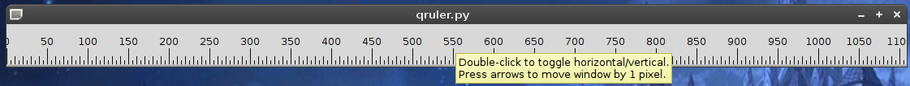

# QRuler #

QRuler displays a simple pixel ruler.
Double-click the ruler to toggle vertical/horizontal orientation.
Press arrow keys to move the ruler by 1 pixel in a direction.

## Download ##

[Project repository](https://github.com/hydrargyrum/attic/tree/master/qruler)

QRuler needs Python and PyQt.
QRuler is licensed under the [Do What the Fuck You Want to Public License](../wtfpl)

