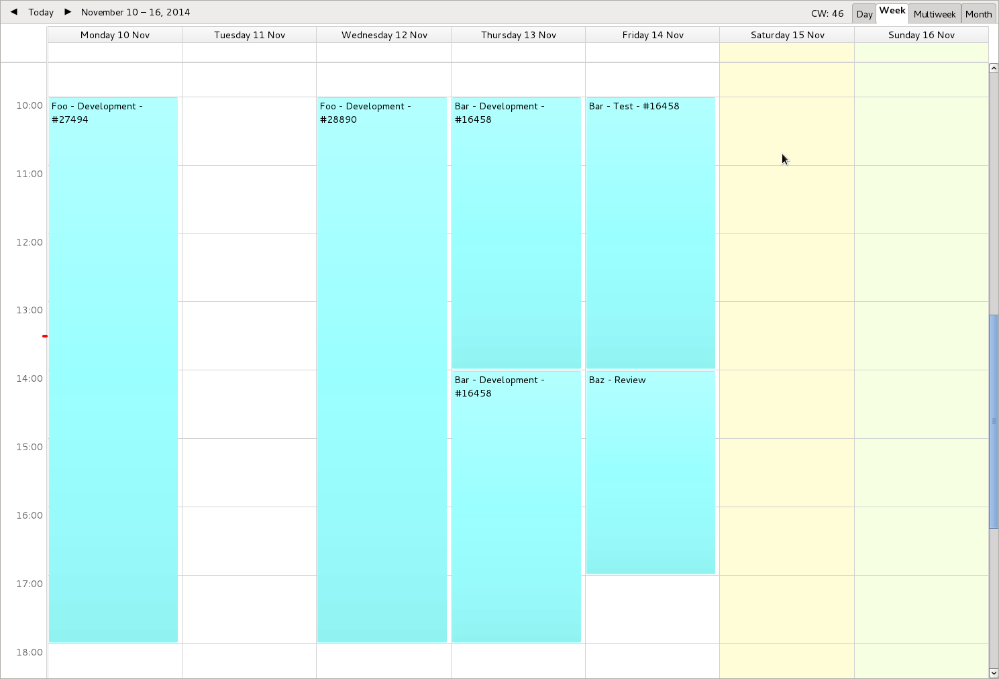

# redmine2ical

Convert Redmine's timesheets to iCalendar format.

# Use case #

If you're required to fill timesheets on Redmine (logging spent time),
but have to fill "holes" because you're lazy and sometimes forgot to do
it, this tool produces an iCal file for easy visualization of where are
the "holes".

It creates a calendar with a calendar event for each entry, with the
date of the timesheet entry, and the duration of the entry. In redmine,
time spent entries have no start time in a day, so, in the generated calendar,
entries start at a certain time (10am by default). When multiple entries are
on the same day, they follow each other so they don't overlap.

Then the resulting .ics file can be imported in any calendar app (like 
Mozilla Thunderbird's Lightning), and the "holes" in the timesheets are 
easy to notice visually.

# Download #

[Project repository](https://github.com/hydrargyrum/attic/tree/master/redmine2ical)

redmine2ical uses Python 2 and is licensed under the [WTFPLv2](../wtfpl).
