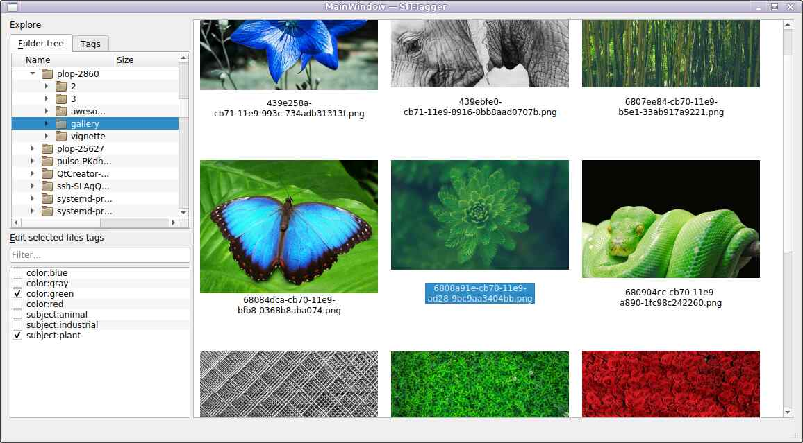
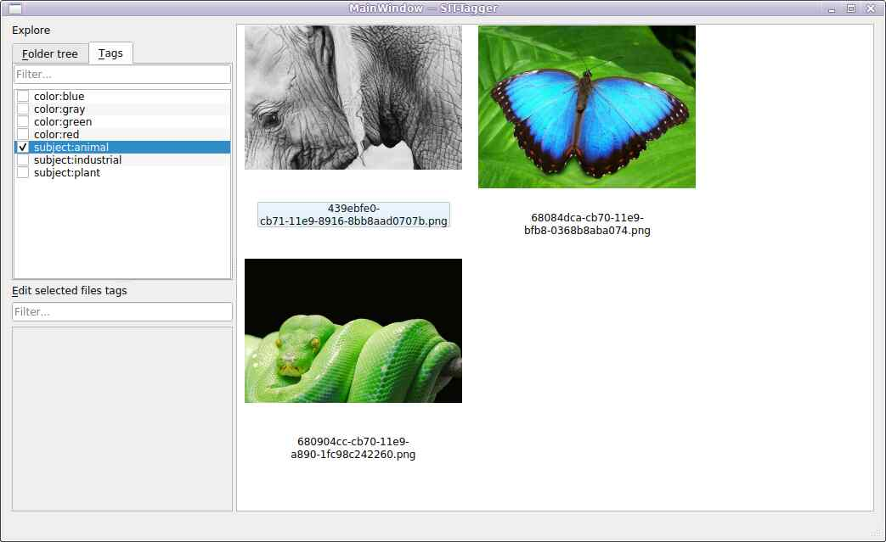
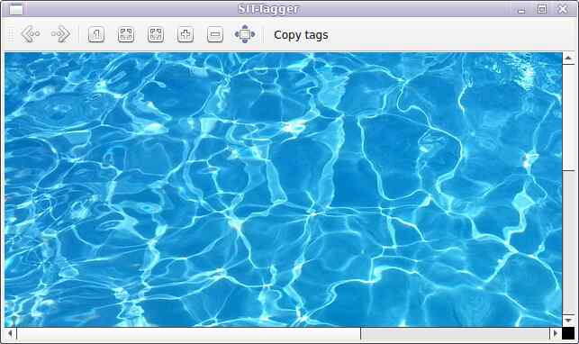

# SIT-Tagger

SIT-Tagger is an image browser/viewer where folders full of images can be browsed, and tags be set to pictures (and saves those tags in a database file).
Then, SIT-Tagger can browse all pictures that were associated to particular tags, instead of only browsing by path.
Pictures can be viewed in a full screen window too.

The tags are saved in a local SQLite database.

# Screenshots

Browse directory tree, select one or more files, and be able to set/unset tags on those files.

List files that have the selected tags (and be able to edit tags of files).

Browse images in a (optionally fullscreen) window with usual zoom options.

# Options

The default database path is `$XDG_CONFIG_HOME/sit-tagger.sqlite` (usually `~/.config/sit-tagger.sqlite`).

If the `$SITTAGGER_DATABASE` environment variable is set, it will be used as the database path.

The database path can also be passed with the `-d`. For example:

	sit-tagger -d /media/sdb1/pictures/tags.db

# Command-line tool

SIT-Tagger comes with a `sit-tagger-cli` command line tool that allows to manipulate files and tags without starting the GUI.

This CLI tool does not require Qt.

## List files having all the specified tags

	sit-tagger-cli query tag1 tag2

## Set/unset tags from files

	sit-tagger-cli set +tag_to_add -tag_to_remove /some/file.jpg /some/file2.png

## List files having at least one tag

	sit-tagger-cli list-files

## List all tags

	sit-tagger-cli list-tags

## List tags of a file

	sit-tagger-cli show /some/file.jpg

## Rename a tag

	sit-tagger-cli rename-tag old_name new_name

## Rename a file

Will not rename the file on hard drive but in the tag database.

	sit-tagger-cli rename-file old_name new_name

## Untrack files

Will not remove the files on hard drive but will forget them from the tag database.

	sit-tagger-cli untrack-files /some/file.jpg

# Download

SIT-Tagger requires Python 3, PyQt5 and [vignette](https://pypi.org/project/vignette/).

It is licensed under the WTFPLv2.

[Project repository](https://gitlab.com/hydrargyrum/sit-tagger)
