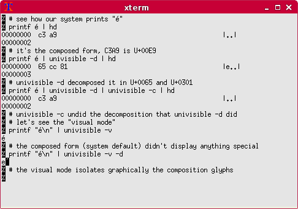

# univisible

A tool to visualize Unicode compositions

# Role

## Reminder about Unicode

Unicode has allows some of its codepoints to be combined together, for example an acute accent (COMBINING ACUTE ACCENT (U+0301)) preceded by an e (LATIN SMALL LETTER E (U+0065)) to produce an accented e: é. The acute accent is a "combining codepoint", because it can be placed after a non-combining codepoint. It can also be put after several combining codepoints, so they are all combined.

However, in this particular case, Unicode also has a third codepoint which combines the former two (LATIN SMALL LETTER E WITH ACUTE (U+00E9)). This means there are two ways to have an "é", the former being "decomposed", and the latter "composed".

While these two ways are [equivalent](https://en.wikipedia.org/wiki/Unicode_equivalence), they are not equal, which leads to redundancy, and a number of problems (complex string comparison for example), but this is out of scope here.

To address the various possibilities, normalization was introduced, NFC/NFKC (which are normalized compositions) and NFD/NFKD (which are normalized decompositions).

## univisible

univisible can convert text to NFKC or NFKD form. It can also show visually the combining codepoints, by separating them from the codepoint they should have been combined with. And also display verbosely each codepoint.

# Sample #

```
% # see how our system prints "é":
% printf é | hd
00000000  c3 a9                                             |..|
00000002
% # it's the composed form, C3A9 is U+00E9
% # let's verify that:
% printf é | univisible -i
é (U+00E9): LATIN SMALL LETTER E WITH ACUTE
% # now we try decomposition:
% printf é | univisible -d | hd
00000000  65 cc 81                                          |e..|
00000003
% # univisible -d decomposed it in U+0065 and U+0301
% # let's verify that:
% printf é | univisible -d -i
e (U+0065): LATIN SMALL LETTER E
́ (U+0301): COMBINING ACUTE ACCENT
% # decomposition doesn't change the end visual anyway
% printf "é\n" | univisible -d
é
% printf é | univisible -d | univisible -c | hd
00000000  c3 a9                                             |..|
00000002
% # univisible -c undid the decomposition that univisible -d did
% # let's see the "visual mode"
% printf "é\n" | univisible -v
é
% # the composed form (system default) didn't display anything special
% printf "é\n" | univisible -v -d
e ́
% # the visual mode separates the composition glyphs
% 
```

The screenshot shows the graphical effect done by ``-v``:



# Usage examples

Decompose Unicode from stdin to stdout:

```
univisible -d
```

Compose Unicode from a file ``foo.txt`` to stdout and convert UTF-8 to UTF-16:

```
univisible -c -f utf-8 -t utf-16 < foo.txt
```

See if foo.txt's has compositions or decompositions:

```
univisible -v < foo.txt
```

Show verbose info of each codepoint:

```
univisible -i < foo.txt
```

# Features

* verbosely display info about each codepoint of an input string
* decompose combined character into basic codepoints and combining codepoints of an input string (NFKD)
* compose combining codepoints and characters if possible (NFKC)
* highlight combining codepoints

# Requirements & Misc

univisible requires Python 3.

# Download

[Project repository](https://gitlab.com/hydrargyrum/attic/tree/master/univisible)
